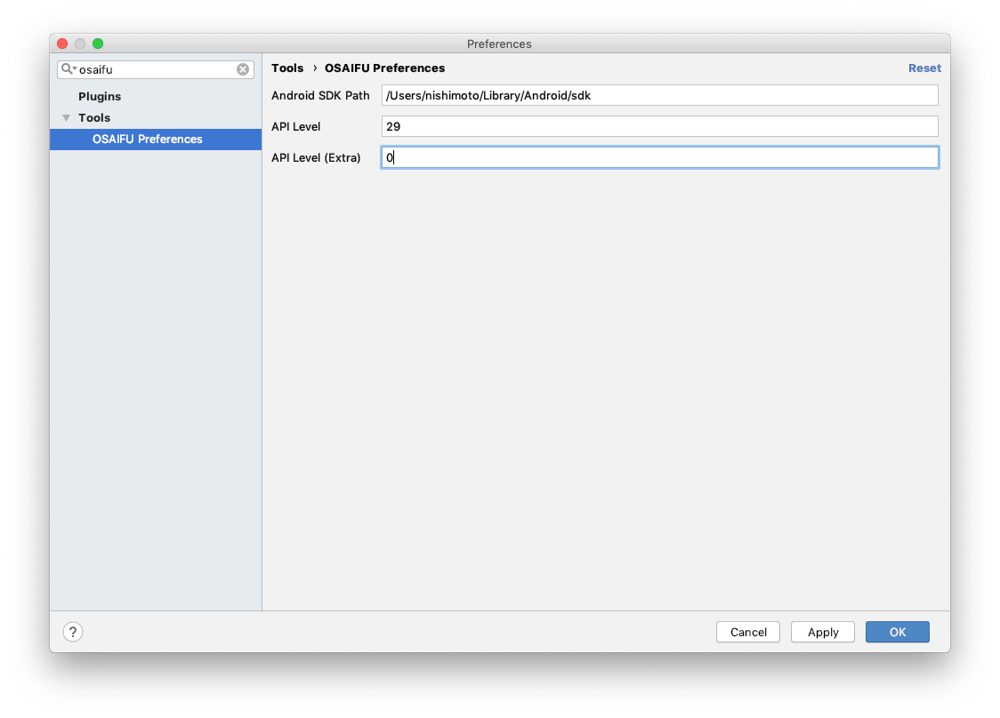
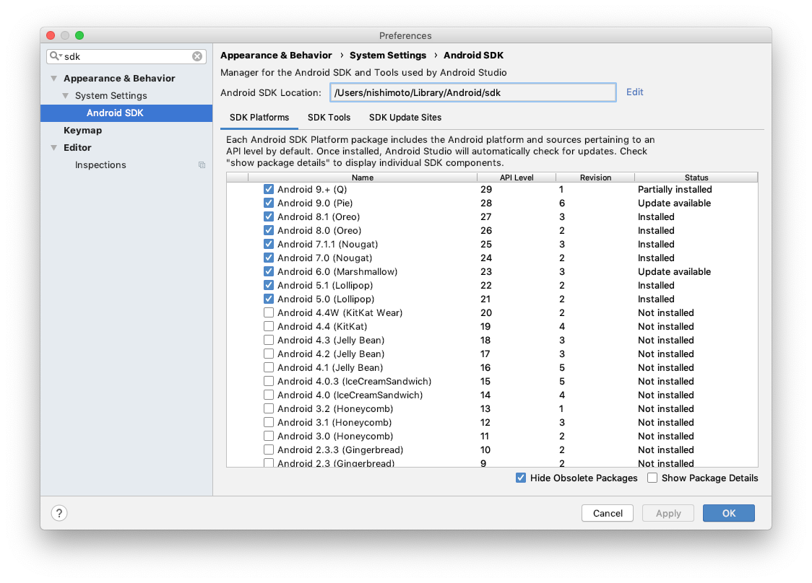
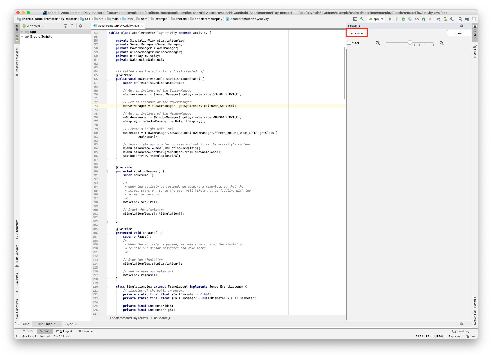

### News
- Comming soon.

### Overview
OSAIFU is a tool for supporting program understanding, implemented as plugin for Android Studio.

OSAIFU automatically factorizes source code at hand, i.e., extracts implemented functionalities from source code by analyzing relations among program elements and shows the summary to the user as a list of clickable tag clouds.
The user can not only browse the list of the summaries to grasp the contents implemented in the source code, but also check how each functionality is implemented by clicking a tag cloud and looking at the corresponding part in the source code that is dynamically highlighted to make it easy to spot.

OSAIFU has been developed by Hata Masahiro, Masashi Nishimoto, Keiji Nishiyama, Hideyuki Kawabata and Tetsuo Hironaka at Hiroshima City University[1].

[1]Masashi Nishimoto, Keiji Nishiyama, Hideyuki Kawabata, and Tetsuo Hironaka, Supporting Program Understanding by Automatic Indexing of Functionalities in Source Code, 17th IEEE/ACIS International Conference on Software Engineering, Management and Applications (SERA 2019), pp.13-18, 2019.

### Requirement
Following programs are required to use OSAIFU.
- Android Studio 3.4.2

Checked environments:
- macOS Mojava 10.14.5

### Installation
1. Execute command `git clone https://github.com/imozuru/OSAIFU.git` to download the [file](https://github.com/imozuru/OSAIFU/tree/master/plugin/OSAIFU.zip).
   - Please install a tool "git LFS" before executing the command. The OSAIFU.zip is 300MB Over.
2. Launch Android Studio.
3. Select "Preferences..." in "Android Studio" menu.
4. Select "Install plugin from disk" in "Plugins".
5. Give the downloaded file (osaifu.zip) to the opened folder selector.

### Settings
The following settings are required when using OSAIFU for the first time.
1. Select "Preferences..." in "Android Studio" menu.
2. Write "Android SDK Path", "API Level" and "API Level(Extra)". In the screenshot, "/Users/nishimoto/Library/Android/sdk", 0 and 29 are set respectively.

- Note that you can obtain Android SDK Path from Preferences of Android Studio.

### Usage
To use OSAIFU, just press the "analyze" button.

### Support or Contact
Having trouble with Pages? Contact [us](mailto:nishimoto.masashi@ca.info.hiroshima-cu.ac.jp) and we’ll help you sort it out.
